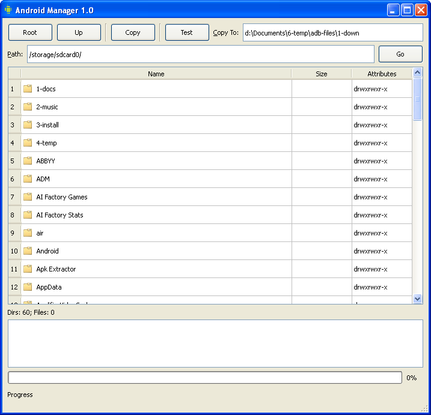
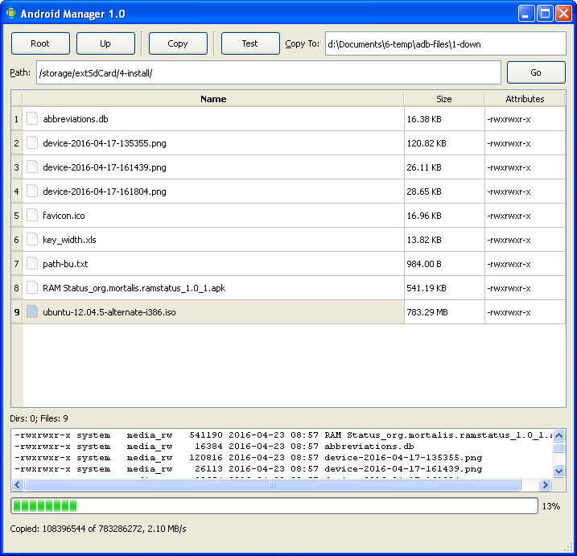

# Android Manager

Android device simple file manager.
Developed using Qt4.

---

## Features

- browse and navigate the Android device filesystem
- get basic file/folder information
- copy files from Android
- navigate using Left/Right arrows
- no need of <b>busybox</b> nor <b>root</b>

## Shortcuts

- **F1** - Go to Root
- **F4** - Go to a folder from the Path field
- **Esc** - Exit

### In the file list:

- **F5** - Copy file
- **Backspace, Left Arrow** - Go to a previous directory
- **Enter, Right Arrow** - Go to a highlighted directory
